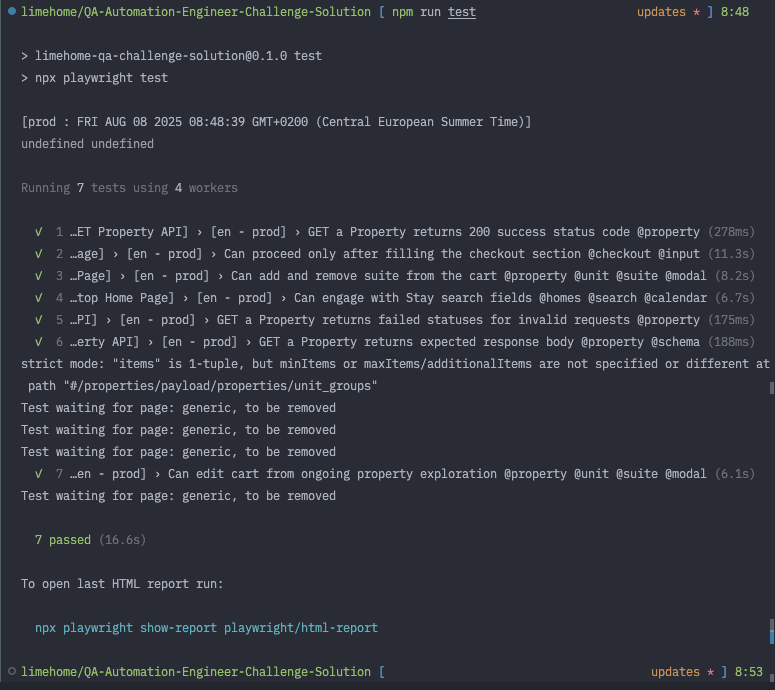

# Task Summary.


Everything below this section are technical outlines. This section focuses on task summary and other relevant documents.
- For Test strategy document, please see `Limehome challenge - QA Engineer. Approach strategy. Chris Enitan` PDF under /QA_Challenge
  - This document also contains some bugs or issues I found while working on the Frontend
- For test scenario breakdown, please see `Limehome challenge - QA Engineer. Test Scenarios. Chris Enitan` sheet under /QA_Challenge
  - I shared an efficiency concern & approach about this sheet on [feedbacks](./QA_Challenge/feedbacks.md) point 3.
- For details on the conventions I used, please see [contributions](./contributing.md)
- There is a Feedback document tracking comments on my progress at hourly intervals. See [feedbacks](./QA_Challenge/feedbacks.md)
- Result for my latest test run can be viewed before overwriting with another test run. `npm run report`
  - I added a visual summary for this on [Gallery](./QA_Challenge/gallery.md)
- The project is large because I included the playwright report data from my last run.


# Introduction

API & End to End tests challenge solutions for the [Limehome UI](https://www.limehome.com/) [Limehome API](https://api.limehome.com/properties/v1/public/).

## Project preconditions

- Target Environments: https://www.limehome.com/en and https://api.limehome.com/properties/v1/public/
- Tests are by default executed against the Applications English language variant except otherwise stated.
- Tests are organized in application page hierarchy. See [Project Structure](#project-structure) for details
- Test default test timeout is `20000` milliseconds and assertion timeout is set to `5000` ms. See the playwright config file for other boundaries.
- Device folder does not constrain test structure, we may consider re-running some desktop test in a different viewport as supported by Playwright.

#### System Requirements 
- Node version and its package manager 20.15 or higher. https://nodejs.org/en/download
- Code Editor
---

## ENV Variables 
You don't need any of these, they are defaulted. But I added the logics to demonstrate easy future adaption.
Set these with the usual Node process env
|Space|Possible Values|
|--|--|
|ENVIRONMENT| `prod`, `local`, `staging` |
---
## Project structure

```
Limehome-test-management
├───environment             - App environment configurations. !.env
├───services          		- Consider to be the Test Core Folder
  	└───Test Type Folder  		- Folder organization according to Application Pages
	  	└───Components  			- Reusable Application component logics
		└───Playwright Fixture		- Folder organization according to Application Pages
		└───Pages Models			- Folder organization according to Application Pages
├───data					- i18n, CSS selectors, files and other static assets
	└───api_schemas				- API Validation Schemas
└───test                    - Main tests directory
  	└───Project  				- API/UI-E2E etc
	  	└───Device  				- Mobile/Desktop/Pad etc (Currently only contains Desktop)
			└───Page  					- Folder organization according to Application Pages
	 			└───scenarios  			- Test scenarios organized according to app areas in spec files
└───types             		- Global Types. (Most Types are declared locally with related entities)
└───test-results            - Playwright test related trace files
└───playwright            	- Playwright automatically generated tests results in HTML format
```
---
## Test Accounts and Data

There are currently no existing accounts needed on the solution but all static test related data are under the `data` folder

## Setup Steps

1. Install all project dependencies on the projects root directory with `npm install`
2. Install necessary Playwright browsers before running tests. Run `npx playwright install `
3. You don't need to, but to update the test envoronment, see the ENV section
4. Get familiar with the simpler helper scripts from the package file. 
   - Run E2E tests: `npm run e2e`
   - Run API tests: `npm run api`
   - Show test report in HTML: `npm run report `
   - Lint and format the project:  `npm run check`


## Steps for running Test

To run tests, use the default playwright commands. Tests are organized in scenario and configured in playwright projects.

- Run directly via command line `npx playwright test`
- Run via package scripts `npm run test`
- Run via the Playwright extension [ms-playwright.playwright](https://marketplace.visualstudio.com/items?itemName=ms-playwright.playwright)

## Test Reports
- HTML Test reports are automatically generated by [Playwright Reporter](https://playwright.dev/docs/trace-viewer-intro#opening-the-html-report)
  - You can run `npm run report` to view them
  - The HTML can also be found under `/playwright/index.html`
- Test run via the terminal also print out reports in standard list format


## Debugging

- Playwright tests can be debugged using the defaults:
  - Tests in debug mode `npx playwright test --debug`
  - Using your code editor extension [ms-playwright.playwright](https://marketplace.visualstudio.com/items?itemName=ms-playwright.playwright)
  - Using the [Trace Viewer](https://playwright.dev/docs/trace-viewer#opening-trace-viewer) or running `npx playwright show-trace path/to/trace.zip`
